## CAN MIM MON
CAN Bus Man-in-the-middle monitor for reverse engineering.  Based on the TI [Isolated CAN FD Repeater Reference Design](https://www.ti.com/tool/TIDA-01487) this circuit board is designed to be placed between a CAN Bus and a specific ECU to identify CAN Bus messages originating from that ECU.  It is a CAN Bus repeater with two additional CAN Bus ports to send the bus traffic to an external logging device.  It can also be used as a simple repeater to allow communication with an existing bus without adding a large stub for the external device (allowing it to be remote from the system under study).

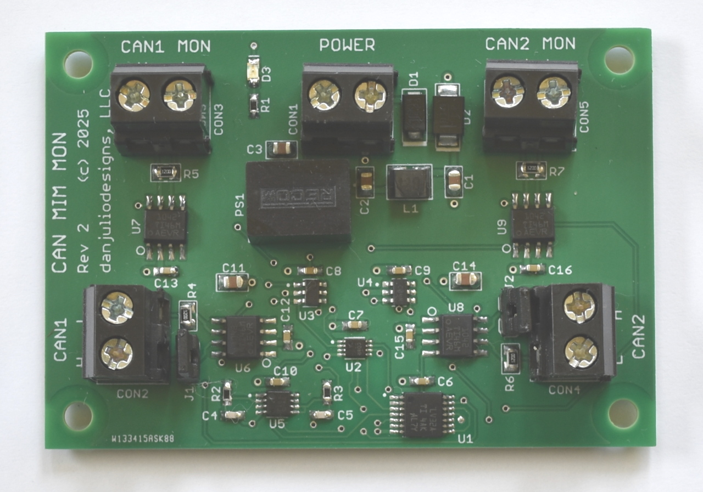

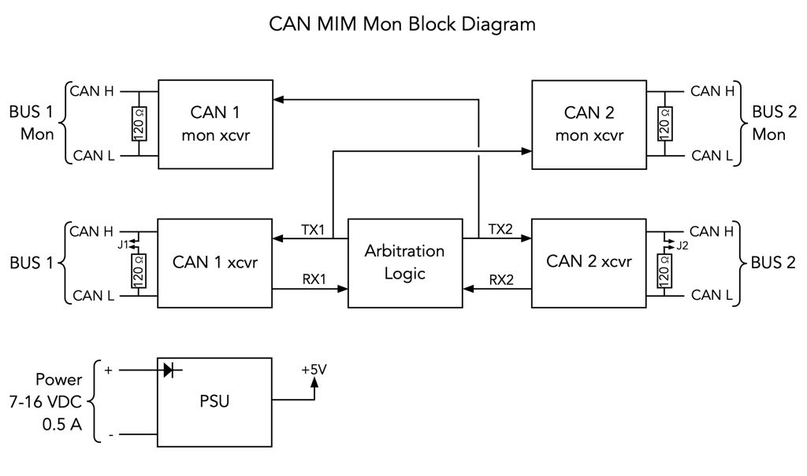

It supports both classic CAN and 2 Mbps CAN FD (untested in my design, but claimed by TI for their circuitry).  It is designed to be powered by a vehicle 12V power supply (7-16 VDC input) with a common ground between CAN devices and the CAN monitoring system.  The power input is reverse-polarity protected.

The CAN1 and CAN2 ports have an optional 120-ohm termination resistor.  The CAN1 MON and CAN2 MON ports have a built-in 120-ohm termination resistor.

This repository contains the gerber files for my Rev 2 PCB.  The file ```documentation/can_mim_mon_loadlist.txt``` contains a simple BOM.  Parts may be ordered from my [Mouser shared project](https://www.mouser.com/Tools/Project/Share?AccessID=fedc605491).

### PCB
The two-sided PCB is 2.75 x 1.9" (69.85 x 48.26mm) and may be ordered as a [PCBWay shared project]().

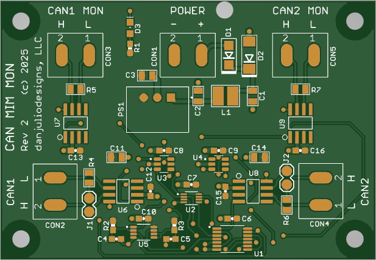

### Use Models

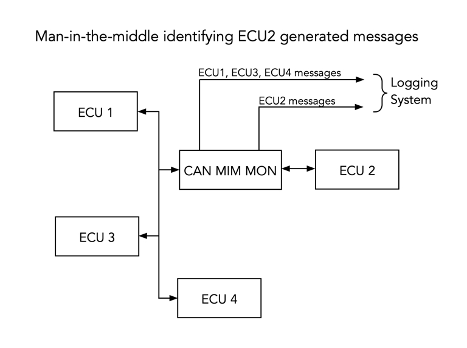

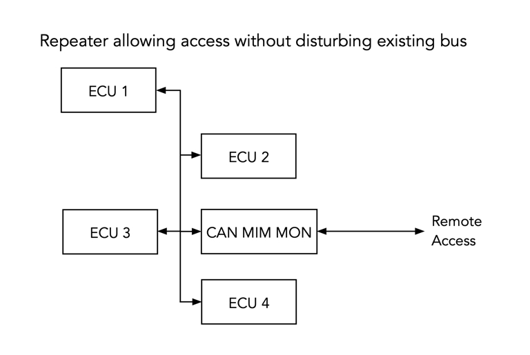

I initially tested the board as an OBD2 port monitor.  It provides power to the monitoring system from the OBD2 port along with two can busses identifying traffic from an external OBD2 device and the vehicle.

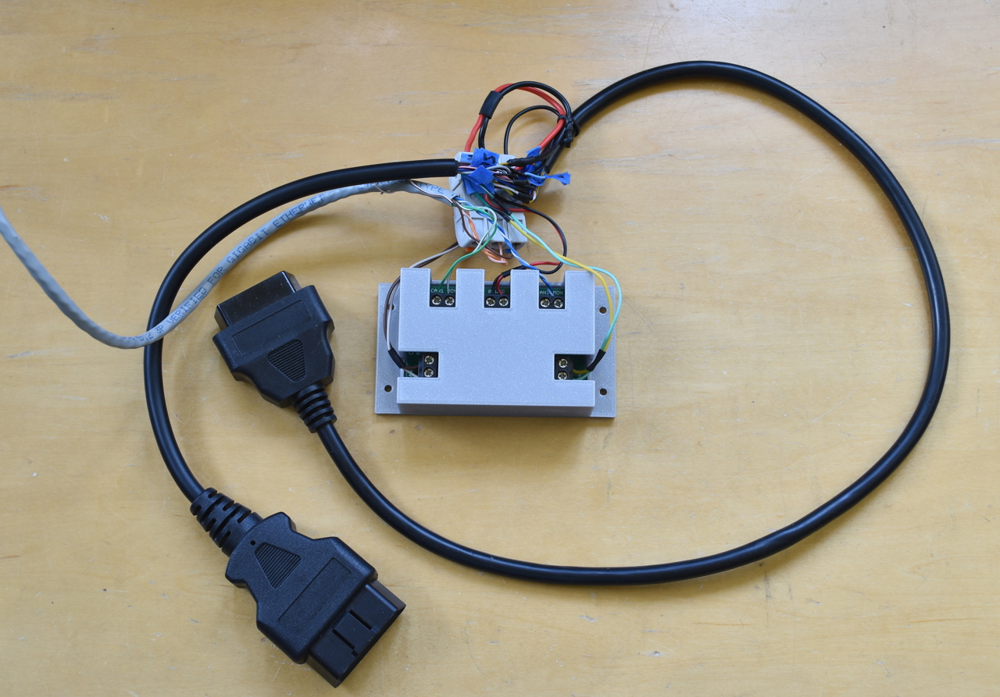

### Theory of Operation
Data is transmitted between CAN1 and CAN2.  As specified in the TI documentation: "The arbitration logic detects which of the two CAN transceivers enter the dominant state first and prevents the loopback of the secondary CAN transceiver side, which would stall the CAN bus into dominant state otherwise".  My addition was another pair of CAN bus transceivers that send the data from each bus to the monitoring system.  Please see the TI document ```tidudb5a.pdf``` at the TI web page above for a detailed theory of operation and simulation results.

Because my schematic was hastily done using off-the-shelf part models, and isn't the clearest, here is the arbitration logic from the TI document using nice old-school logic symbols.

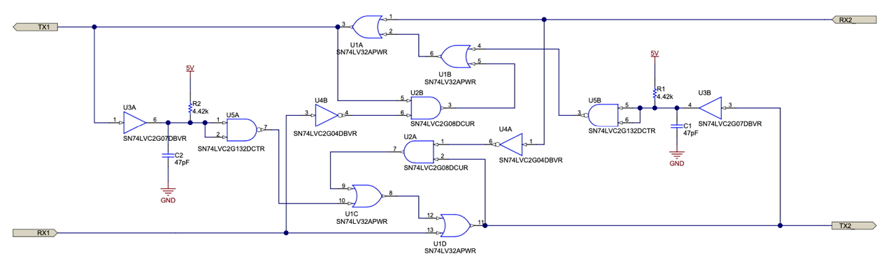

### 3D printed enclosure
A simple OpenSCAD 3D printed enclosure and associated STL files may be found in the ```enclosure``` sub-directory.  Be sure to slice with supports.


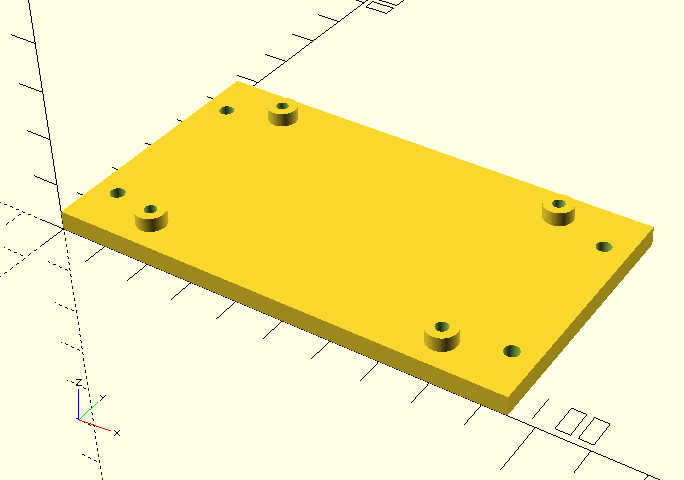

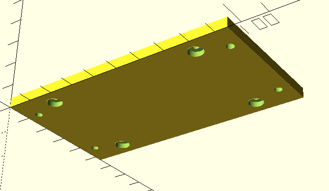

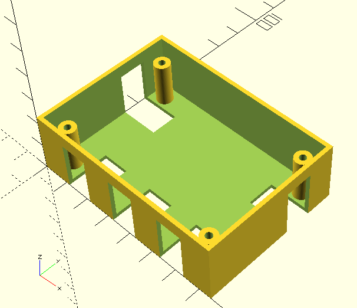

The enclosure is designed for #3 (2.5mm) self-tapping screws.  Sorry I don't have a part number.  I just grabbed from what I had in my screw collection.

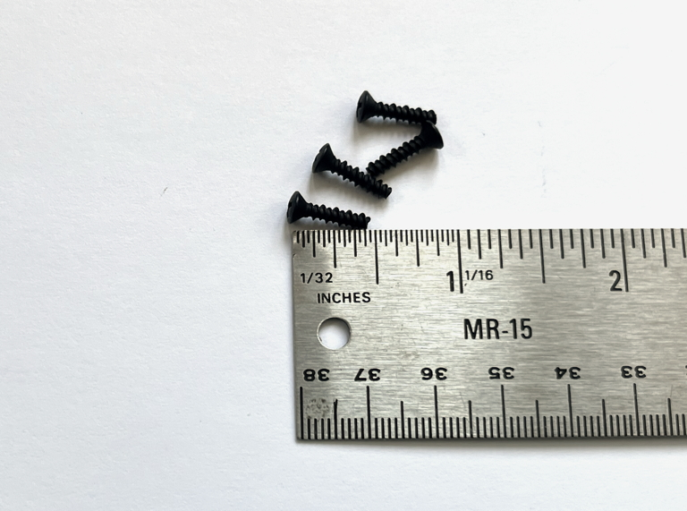